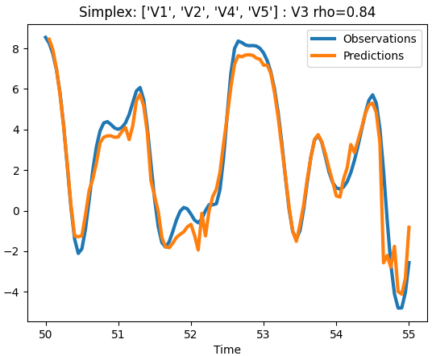

.. title:: User guide : contents

.. _user_guide:

==========
User Guide
==========

Empirical Dynamic Modeling
--------------------------

.. _EDM Wikipedia: https://en.wikipedia.org/wiki/Empirical_dynamic_modeling
.. _EDM Docs: https://sugiharalab.github.io/EDM_Documentation/
.. _convex simplex: https://en.wikipedia.org/wiki/Simplex
.. _convergent cross mapping (CCM): https://www.science.org/doi/10.1126/science.1227079
.. _Convergent cross mapping (CCM): https://www.science.org/doi/10.1126/science.1227079
.. _CCM Wikipedia: https://en.wikipedia.org/wiki/Convergent_cross_mapping
.. _simplex: https://www.nature.com/articles/344734a0
.. _sequential locally weighted global linear maps (s-map): https://doi.org/10.1098/rsta.1994.0106
.. _s-map: https://doi.org/10.1098/rsta.1994.0106
.. _s-map coefficients: https://doi.org/10.1098/rspb.2015.2258
.. _Lorenz'96: https://en.wikipedia.org/wiki/Lorenz_96_model
.. _Tan 2023: https://doi.org/10.1063/5.0137223

Empirical dynamic modeling (EDM) is a framework for analysis and prediction of nonlinear dynamical systems with over 4,000 citations to its core algorithms: `convergent cross mapping (CCM)`_, simplex_, and `sequential locally weighted global linear maps (s-map)`_. EDM continues to evolve with new applications and algorithmic extensions as documented in the `EDM Wikipedia`_ article. An in-depth introduction is provided in `EDM docs`_.

`sciedm`
--------
`sciedm` provides a scikit-learn compliant implementation of core EDM algorithms along with utilities to discover appropriate embedding dimension and scale of state-dependence (nonlinearity). `sciedm` classes are based on the :class:`sklearn.base.BaseEstimator` with `Regressor` and `Transformer` mixin's defining the core `sciedm` classes:

=========================================================== ====================
Class                                                       Function
----------------------------------------------------------- --------------------
:class:`Simplex (RegressorMixin, BaseEstimator)`            simplex
:class:`SMap (RegressorMixin, BaseEstimator)`               s-map
:class:`CCM (TransformerMixin, BaseEstimator)`              CCM
:class:`EmbedDimension (TransformerMixin, BaseEstimator)`   embedding dimension
:class:`PredictNonlinear (TransformerMixin, BaseEstimator)` nonlinear dependence
=========================================================== ====================

`sciedm` leverages `pandas DataFrame` for I/O. Input data are expected to be a `DataFrame` with named columns including the target variable. The first column is expected to be a series of time or date values or strings, however this requirement can be removed with the `noTime=True` flag.

Example Data
~~~~~~~~~~~~
We use two data sets to illustrate `sciedm`. First a 5-dimensional coupled system generated from the `Lorenz'96`_ model.

.. Lorenz5D_V1_V2_V3:
.. figure:: figures/Lorenz5D_V1_V2_V3.png
   :alt: Lorenz'96 5-D 
   :align: center
   :scale: 70%

   First 3 components of a Lorenz'96 5-D system.

Second, cumulative daily water flow into Everglades National Park through the S12C, S12D and S333 spillways.

.. SumFlow:
.. figure:: figures/SumFlow.png
   :alt: Daily cumulative flow into ENP.
   :align: center
   :scale: 80%

   Daily cumulative flow into Everglades National Park through S12C,D S333.

Predictors
----------
`sciedm` predictors include :class:`Simplex` and :class:`SMap`.

Simplex
~~~~~~~
:class:`Simplex` is a nearest neighbor projection in the embedding from a  `convex simplex`_ query state to a future (or past) state. It is the core of cross mapping, convergent cross mapping, and dimension estimation, inherently provides out of sample (train:test) validation with the `lib` and `pred` parameters, and provides for exclusion of serially correlated states to focus on nonlinear dynamics with a temporal `exclusionRadius` parameter.
        
Here we use `Simplex` to predict variable `V3` from a 4-D multivariate embedding of `[V1,V2,V4,V5]` of the 5-D Lorenz'96 system. To specify a multivariate embedding instead of a time-delay embedding we set `embedded=True` which sets the embedding dimension to `E=4`. The default prediction horizon is `Tp=1` points ahead. ::

    >>> from sciedm import Simplex
    >>> df = read_csv("../sciedm/data/Lorenz5D.csv")
    >>> lib, pred = [1,500], [801,900] # out of sample library : prediction sets
    >>> columns, target = ['V1','V2','V4','V5'], 'V3'
    >>> smpx = Simplex(columns=columns, target=target, lib=lib, pred=pred, embedded=True)
    >>> smpx.fit(df)
    >>> rho = smpx.score(df, df[target])

    >>> from sciedm.aux_func import PlotObsPred
    >>> ax = PlotObsPred(smpx.Projection_,
    ...      title=f"Simplex: {smpx.columns} : {smpx.target} rho={rho:.2f}")

.. Simplex_CrossMap_embedded:

   Simplex prediction at `Tp=1` of Lorenz'96 5-D variable `V3` from a multivariate embedding of `['V1','V2','V4','V5']`

Even though the embedding does not contain `V3` the shared dynamical information in the other variables enables good prediction of `V3` through simplex cross mapping.

SMap
~~~~
Sequential locally weighted global linear maps (`s-map`_) can be viewed as a generalized forerunner of locally linear embedding. Instead of a fixed number of embedding neighbors an exponential localization kernel selects neighbors based on distance scale in the embedding allowing one to identify an optimal scale along system trajectories reflecting state dependence (nonlinearity). The scale is determined by a weight function: :math:`F(\theta )={\text{exp}}(-\theta d/D)` where `θ` is the localization parameter, `d` a specific neighbor distance, and `D` the mean distance to all neighbors. At `θ=0` all neighbors are equally weighted corresponding to the global linear map, if predictability is maximal at `θ=0` there is not evidence for state dependence (nonlinearity).

When an s-map model is tuned to the scale appropriate for the dynamics, it is known `s-map coefficients`_ correspond to the time and state dependent derivatives between variables. As such, s-map facilitates prediction and quantification of both intervariable dependencies (Jacobians) and the scale of nonlinearity of multivariate dynamical systems.

Here we demonstrate :class:`SMap` in multivariate time series prediction and variable interaction. The nearest neighbor localization parameter `theta=8` weights local neighbors at small scale (distances) in the embedding. ::

  >>> from sciedm import SMap
  >>> smap = SMap(columns=columns, target=target, theta=8.,
  ...             embedded=True, lib=lib, pred=pred)
  >>> smap.fit(df)
  >>> rho = smap.score(df, df[target])
  
  >>> from sciedm.aux_func import PlotObsPred, PlotCoeff
  >>> title = f"SMap: {smap.columns} : {smap.target} rho={rho:.2f}"
  >>> ax = PlotObsPred(smap.Projection_, title=title)
  >>> ax = PlotCoeff(smap.Coefficients_, title=title)

.. SMap_CrossMap_embedded:
.. figure:: figures/SMap_CrossMap_embedded.png
   :alt: SMap projection of Lorenz'96 5-D 
   :align: center
   :scale: 80%

   SMap prediction at `Tp=1` of Lorenz'96 5-D variable `V3` from a multivariate embedding of `['V1','V2','V4','V5']` and intervariable derivatives (coefficients).

Transformers
------------
Convergent cross mapping, embedding dimension estimation and assessment of nonlinear state dependence are implemented as :class:`Transformer` classes.

CCM
~~~
Convergent cross mapping (CCM) identifies whether two time series belong to the same dynamical system and are therefore causally related. The `CCM Wikipedia`_ page provides a detailed description.

Although we know the variables of the Lorenz'96 system are causally related, we use them as a demonstration. ::

   >>> from sciedm import CCM
   >>> df = read_csv("../sciedm/data/Lorenz5D.csv")
   >>> libSizes = [20,50,100,200,500,900,1000]
   >>> ccm = CCM(columns='V1', target='V5', E=5, libSizes=libSizes)
   >>> ccm_V1_V5 = ccm.fit_transform(X=df)

   >>> from sciedm.aux_func import PlotCCM
   >>> ax = PlotCCM(ccm.libMeans_, title=f"E={ccm.E} {ccm.columns} : {ccm.target}")

.. CCM_Lorenz_V1_V5:
.. figure:: figures/CCM_Lorenz_V1_V5.png
   :alt: CCM Lorenz'96 V1:V5
   :align: center
   :scale: 80%

   CCM between Lorenz'96 V1 and V5.

As expected both mappings V1:V5 (V5 drives V1) and V5:V1 (V1 drives V5) exhibit convergence and high predictability.

Embedding Dimension
~~~~~~~~~~~~~~~~~~~
EDM methods are predicated on an `E` (or higher) dimensional embedding from which predictions are made and variables characterized. Robust estimation of embedding dimension remains an open problem (`Tan 2023`_) with EDM taking a data-driven and practical approach: optimization of system predictability as a function of embedding dimension. Here we estimate embedding dimension of the Everglades flow data with `exclusionRadius=3` to avoid serial correlation at time steps less than 3 days. ::

  >>> from sciedm import EmbedDimension
  >>> df = read_csv("../sciedm/data/S12CD-S333-SumFlow_1980-2005.csv")
  >>> edim = EmbedDimension(columns='SumFlow', target='SumFlow', exclusionRadius=3)
  >>> EDim = edim.fit_transform(df)
  
  >>> from sciedm.aux_func import PlotEmbedDimension
  >>> title = f"{edim.columns} Tp={edim.Tp} exclusionRadius={edim.exclusionRadius}"
  >>> ax = PlotEmbedDimension(edim.E_rho_, title=title)

.. EmbedDim_SumFlow:
.. figure:: figures/EmbedDim_SumFlow.png
   :alt: Embedding dimension of Everglades flow
   :align: center
   :scale: 80%

   Simplex prediction correlation of Everglades flow as a function of embedding dimension.

The result suggests an embedding dimension of `E=4` is a reasonable choice for simplex and s-map application. 

Predict Nonlinear
~~~~~~~~~~~~~~~~~
Class :class:`PredictNonlinear` evaluates `SMap` predictions across a range of `theta` values. ::

  >>> from pandas import read_csv
  >>> from sciedm import PredictNonlinear
  >>> df = read_csv("../sciedm/data/S12CD-S333-SumFlow_1980-2005.csv")
  >>> pnl = PredictNonlinear(columns='SumFlow', target='SumFlow', E=4, Tp=3)
  >>> theta_rho = pnl.fit_transform(df)

  >>> from sciedm.aux_func import PlotPredictNonlinear
  >>> title=f"{pnl.columns} : {pnl.target}  E={pnl.E}  Tp={pnl.Tp}"
  >>> PlotPredictNonlinear(pnl.theta_rho_, title=title)

.. PredictNL_SumFlow:
.. figure:: figures/PredictNL_SumFlow.png
   :alt: S-map theta dependence of Everglades flow
   :align: center
   :scale: 80%

   SMap prediction correlation of Everglades flow as a function of SMap localization parameter `theta`.

Here we find evidence of nonlinear state dependence with peak predictability at `theta = 3` at `E = 4` `Tp = 3`. 
